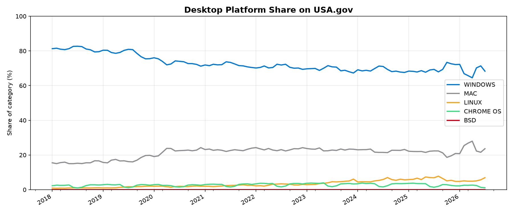
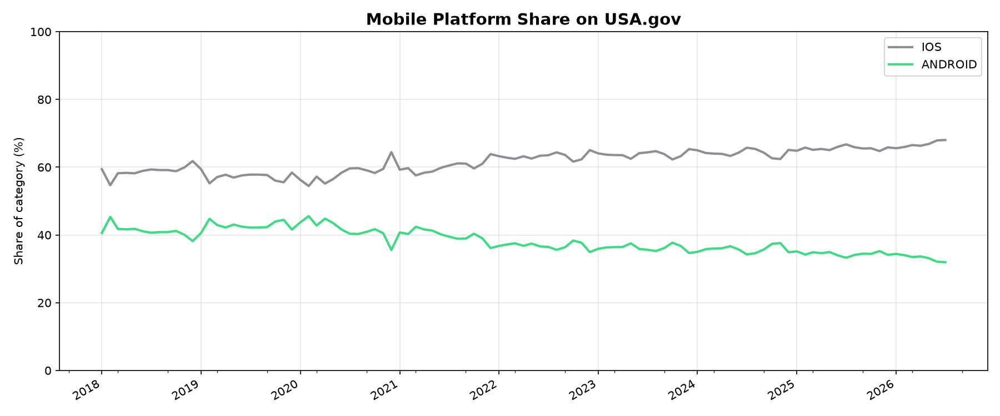

*This README is auto-generated. Do not edit manually — changes will be overwritten.*

# Platform Share on USA.gov

Monthly desktop and mobile platform usage based on [DAP (Digital Analytics Program)](https://digital.gov/guides/dap/) OS visit data.

See [`analysis/os_filter.json`](analysis/os_filter.json) for which desktop platforms are included and excluded.

**Data range:** 2018-01 to 2026-07

## Desktop platforms



### Latest month (2026-07)

| Platform | Share |
| --- | ---: |
| WINDOWS | 68.3% |
| MAC | 23.6% |
| LINUX | 6.9% |
| CHROME OS | 1.1% |
| BSD | 0.0% |

## Mobile platforms



### Latest month (2026-07)

| Platform | Share |
| --- | ---: |
| IOS | 68.0% |
| ANDROID | 32.0% |

## Regenerate locally

```bash
pip install -r requirements.txt
python analysis/generate_readme.py
```
